**TATA STEEL SNTI **

**Data analysis**  

**using Python**

Submitted by : 

VT20223143 

HIMANSHU KUMAR 

INSTITUTE OF TECHNICAL EDUCATION (B.TECH CSE) 

**INDEX**

|HEADING |PAGES |
| - | - |
|Acknowledgement |3 |
|Introduction |4 |
|Challenges of the problem |5 |
|Tech Stack Details |6-7 |
|Data Description  |8-9 |
|Exploratory Data Analysis |11-18 |
|Data Cleaning  |19 |
|Data Aggregation  |20-22 |
|Modelling  |23-25 |
|Model Evaluating |26 |
|Summary  |27 |
**ACKNOWLEDGEMET** 

I, **Himanshu Kumar, VT20223143**, would like to express my gratitude to my guide, **Mr. Adepu Sai Preetham**, and my sponsor, for allowing me to work on this project on **"Predict future sales” using Python** and for all of their assistance and guidance that enabled me to complete this project successfully. Finally, I'd like to express my gratitude to Tata Steel, SNTI, for providing this interesting internship opportunity for students like me to get industrial experience systematically . 

**Mr. Adepu Sai Preetham** 

**INTRODUCTION** 

It is an integral part of the business to make an intelligent business decision to save cost or gain more profit. Good forecasting can help to ensure the retailers maintain adequate inventory levels, mitigate the chance of stock obsolete, or supply the right product at the right time and location. For example, if the forecast indicates a 25% increase in sales of products or services, the store can purchase those products ahead to meet the demand. Conversely, a forecast of shortfalls in sales can allow people to mitigate the effect by taking actions ahead . 

Predicting the future is one of the most relevant and challenging tasks in applied sciences. Building effective predictors form historical data demands computational and statistical methods for inferring dependencies between past and short-term future values of observed values as well as appropriate strategies to deal with longer horizons.

**Challenges of the problem** 

Our project is Predict Future Sales, which is a Kaggle competition relating to time series prediction. In this competition the participants work with a challenging time-series dataset consisting of daily sales data, kindly provided by one of the largest Russian software firms - 1C Company. We are asked to predict total sales for every product and store in the next month. This project inscribes in this context, it will essentially focus on Development and Deployment of a forecasting model that relies on Machine Learning and Time-Series analysis techniques. 

Building a good model from observed time series data is challenging because time series data are usually unstable and continuous. For instance, future sales can be affected by new products launch, promotions available, seasonality, and other changes that make it very difficult to predict using past behaviors. Furthermore, there is only a single historical sample available in each data instance, hence, we might need to add lag terms to perform the forecasting task.

**Tech Stack Details** 

1.  (Python) **Python** is a[ high-level,](https://en.wikipedia.org/wiki/High-level_programming_language)[ general-purpose programming language.](https://en.wikipedia.org/wiki/General-purpose_programming_language) Its design philosophy emphasizes[ code readability ](https://en.wikipedia.org/wiki/Code_readability)with the use of[ significant indentation.](https://en.wikipedia.org/wiki/Off-side_rule) Libraries such as[ NumPy,](https://en.wikipedia.org/wiki/NumPy)[ SciPy,](https://en.wikipedia.org/wiki/SciPy) and[ Matplotlib ](https://en.wikipedia.org/wiki/Matplotlib)allow the effective use of Python in scientific computing, 
1.  (Anaconda)  Anaconda is an open-source distribution for python and R. It is used for [data science, ma](https://www.edureka.co/blog/how-to-learn-data-science/)[chine learning, deep le](https://www.edureka.co/blog/introduction-to-machine-learning/)[arning, etc. With ](https://www.edureka.co/blog/deep-learning-with-python/)the availability of more than 300 libraries for data science, it becomes fairly optimal for any programmer to work on anaconda for data science . Anaconda helps in simplified package management and deployment. Anaconda comes with a wide variety of tools to easily collect data from various sources using various machine learning and AI algorithms. It helps in getting an easily manageable environment setup which can deploy any project with the click of a single button.
1. **Microsoft Excel** is a[ spreadsheet ](https://en.wikipedia.org/wiki/Spreadsheet)developed 

by[ Microsoft ](https://en.wikipedia.org/wiki/Microsoft)for[ Windows,](https://en.wikipedia.org/wiki/Microsoft_Windows)[ macOS,](https://en.wikipedia.org/wiki/MacOS)[ Android ](https://en.wikipedia.org/wiki/Android_\(operating_system\))and[ iOS.](https://en.wikipedia.org/wiki/IOS) It 

features[ calculation ](https://en.wikipedia.org/wiki/Calculation)or[ computation ](https://en.wikipedia.org/wiki/Computation)capabilities, graphing tools,[ pivot tables,](https://en.wikipedia.org/wiki/Pivot_table) and a[ macro ](https://en.wikipedia.org/wiki/Macro_\(computer_science\))programming language called[ Visual Basic for Applications ](https://en.wikipedia.org/wiki/Visual_Basic_for_Applications)(VBA). Excel forms part of the[ Microsoft Office ](https://en.wikipedia.org/wiki/Microsoft_Office)suite of software.

**Dataset Description** 

We were provided with daily historical sales data .The task is to anticipate the total quantity of products sold in each test group store. We note that the list of stores and products changes slightly every month. We have a set of data stored in the following files. 

**File Description :**  

- sales\_train.csv: the training set. Daily historical data from January 2013 to October 2015.  
- items.csv: supplemental information about the items/products. 
  - item\_categories.csv: supplemental information about the items categories.  
- test.csv: the test set. We need to forecast the sales for these shops and products for November 2015.  
- shops.csv: supplemental information about the shops. 
  - sample\_submission.csv - a sample submission file in the correct format

**Features Description :** 

- *Independent variable*
- item\_cnt\_day - number of products sold. We are predicting a monthly amount of this 

measure. 

- Dependent variable: 
  - ID - an Id that represents a (Shop, Item) tuple within the test set.  
- shop\_id - unique identifier of a shop.  
- item\_id - unique identifier of a product.  
- item\_category\_id - unique identifier of item category 
- item\_price - current price of an item  
- date - date in format dd/mm/yyyy  
- date\_block\_num - a consecutive month number, used for convenience. January 2013 

is 0, February 2013 is 1, …, October 2015 is 33 

- item\_name - name of item 
- shop\_name - name of shop  
- item\_category\_name - name of item category 

**Experimental Processes** 

Knowledge Discovery and Data Mining (KDD) is a multidisciplinary field focused on methodologies for extracting useful knowledge from data. The challenge of extracting knowledge from data draws upon research in statistics, databases, pattern recognition, machine learning, data visualization, optimization, and high-performance computing to provide advanced intelligence and useful solutions. The continuous rapid growth of data has created a huge need for KDD methodologies. The KDD process is classified in Four main stages whish are:  

1. Clean, Collect, Summarize  
1. Data Preparation 
1. Data Mining  
1. Evaluation & Validation 

**Data Import :** 

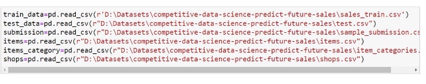

**Exploratory Data Analysis :** 

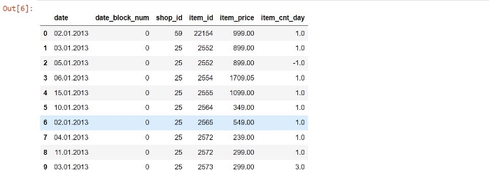

To take a closer look at the data took help of “ .head()”function of pandas library which returns first five observations of the data set. Similarly “.tail()” returns last five observations of the data set. 

- Dataset comprises of 2935849 observations and 6 characteristics. 
- Out of which one is dependent variable and rest 5 are dependent variables . 

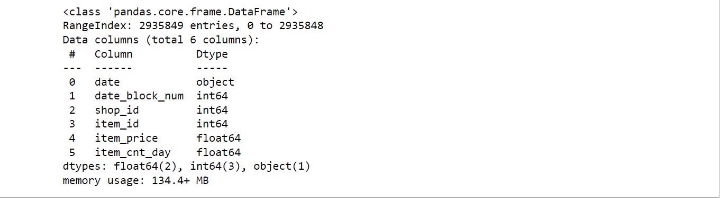

It is also a good practice to know the columns and their corresponding data types, along with finding whether they contain null values or not. 

- Data has only object and integer values. 
- No variable column has null/missing values. 

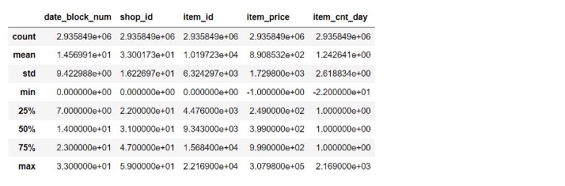

The describe() function in pandas is very handy in getting various summary statistics. This function returns the count, mean, standard deviation, minimum and maximum values and the quantiles of the data. 

- date\_block\_num, item price, and item\_cnt\_day have a high standard deviation because of the large difference between their minimum and maximum values. This is also the reason why outliers can be seen in item price and item count below. 

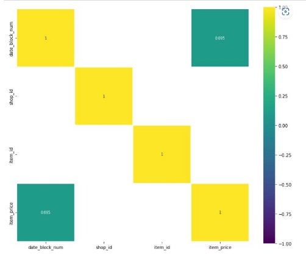

The above snippet tells us the correlation between different columns . 

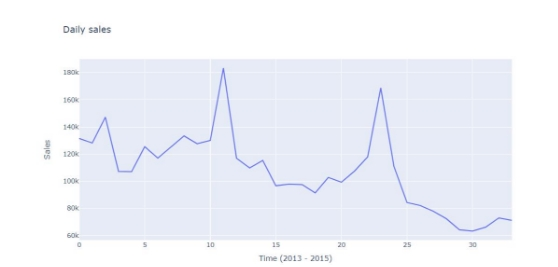

We use plotly library to plot sales v/s Time graph . In this code snippet we group train\_data with ‘date\_block\_num’ and sum each ‘item\_cnt\_day’ . We observe that Generally, sales from shops show a downward trend towards 2015. Peaks in sales can be seen between the days 20 and 25 probably because this is the time that most customers receive their monthly salaries. Another peak can be seen between the days 10 and 12 which could be influenced by special offers provided by shops.

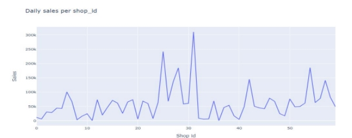

We group data by shop\_id and sum each item\_cnt\_day . 

We observe that shop\_id 31 has the highest number of sales .  

we group by shop\_id and date\_block\_num . Then for each unique shop\_id a plot is drawn .

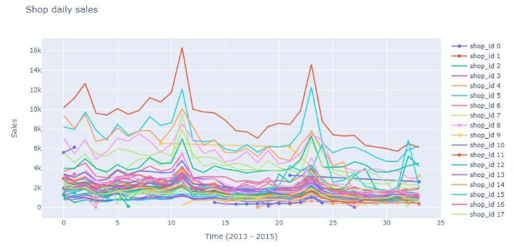

We define a dataframe with name ‘data’ which consist of only three column names('date\_block\_num','shop\_id','item\_price', 'item\_cnt\_day').   

We then define a function ‘num\_plot’ which has argument df and data . The num\_plot function makes three subplot namely , **distribution plot** ,  **probability plot**  and  **boxplot.** 

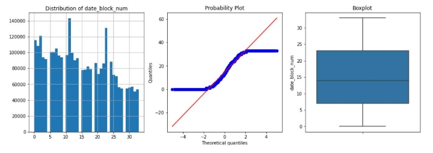

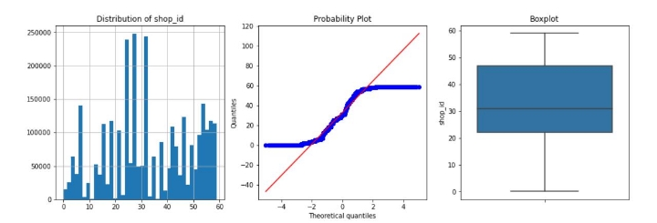

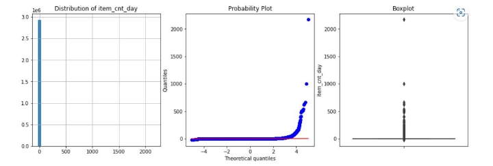The probability plot is a graphical technique for assessing whether or not a data set follows a given distribution such as the normal or Weibull. 

The data are plotted against a theoretical distribution in such a way that the points should form approximately a straight line. Departures from this straight line indicate departures from the specified distribution. 

We merge different dataset together to form df . 

Seeing the above plot we get an idea of number of sales per shop. 

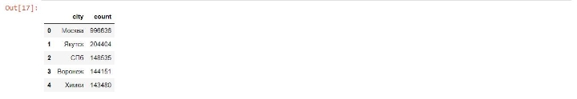

Москва is the city with highest count. Lets represent this with graph.

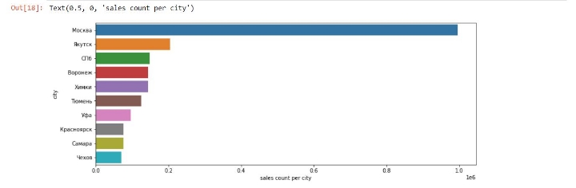

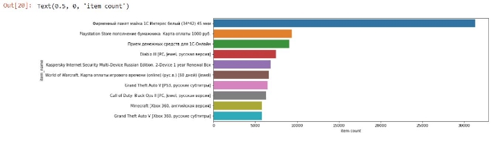

Thus, Фирменный пакет майка 1С Интерес белый (34\*42) is the most bought after item. 

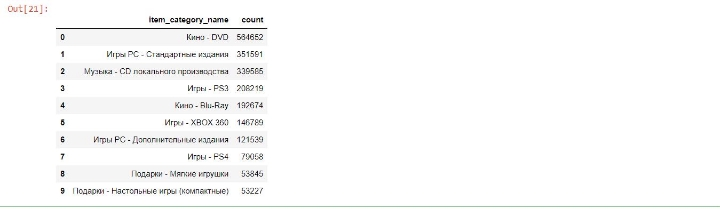

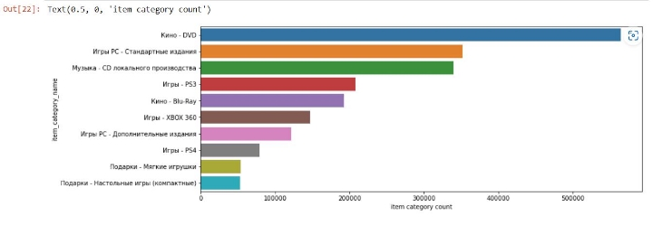

Кино - DVD category had the highest sells. **Summary of primary EDA :** 

- Using isnull().sum() , we found that there are no null values.** 
- From .describe() , we found that there are negative values.** 
- Clearly from above histograms and boxplot , we see that **item\_price** and **item\_cnt\_day** have outliers. 

**Data Cleaning :** 

Data cleaning, or data cleansing, is the important **process of correcting or removing incorrect, incomplete, or duplicate data within a dataset**. Data cleaning **should be the first step in the workflow**. When working with large datasets and combining various data sources, there’s a strong possibility of  duplicate or mislabel data. If one have inaccurate or incorrect data, it will lose its quality, and ML algorithm’s outcomes become unreliable. 

**Objectives :** 

- Increase the reliability of overall dataset. 
- Remove data items with higher standard deviation . 
- Remove data items with negative value. 

**Data Aggregation :** 

Data aggregation refers to a process of collecting information from different sources and presenting it in a summarized format so that business analysts can perform statistical analyses of business schemes. The collected information may be gathered from various data sources to summarize these data sources into a draft for data analysis. This step is the major step taken by any business organization because the accuracy of insights from data analysis majorly depends on the quality of data they use. It is very necessary to collect quality content in huge amounts so that they can create relevant outcomes. Data aggregation plays a vital role in finance, product, operations, and marketing strategies in any business organization. Aggregated data is present in the data warehouse that can enable one to solve various issues, which helps solve queries from data sets. 

**Objective :** 

- Create Monthly count 
- Merge Shop name with cities. 
- Group By "month", "date\_block\_num", "shop\_id", "item\_id", "item\_price", "item\_cnt\_day"
- Aggregate each of newly formed columns. 

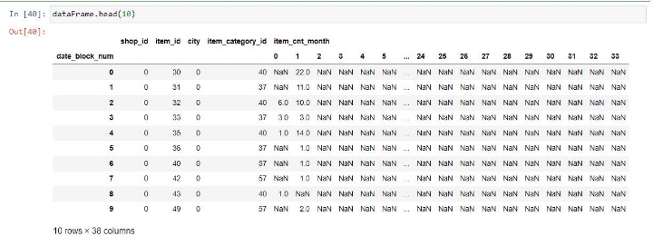

**Making test data and train data equal dimension:** 

We make test data equal size with train data by merging test data with items dataset and shopshop dataset. In item dataset we take 'item\_id','item\_category\_id' and in shop dataset we take 'shop\_id' and 'city' . 

We then, merge test\_data with dataframe on 'shop\_id','item\_id','city','item\_category\_id' . Dataframe looks like this , 

Defining Lag : 

Lag : The steps that are considered to shift the data backward in the time(sequence), called lag times or lags.  

Why Lag is important ? 

To transform a time series model to supervised ml problem lag is used.   Our df dataframe after adding sufficient lag . 

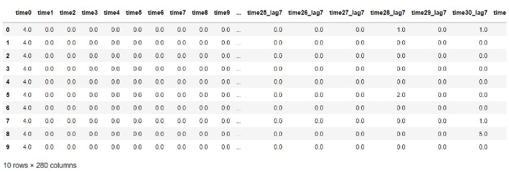

**Modelling :**

**Long Short Term Memory** networks – usually just called “LSTMs” – are a special kind of RNN, capable of learning long-term dependencies. They were introduced by[ Hochreiter & ](http://www.bioinf.jku.at/publications/older/2604.pdf)

[Schmidhuber (1997),](http://www.bioinf.jku.at/publications/older/2604.pdf) and were refined and popularized by many people in following work.  

LSTMs  are  explicitly  designed  to  avoid  the  long-term  dependency  problem.  Remembering information for long periods of time is practically their default behavior, not something they struggle to learn! 

All recurrent neural networks have the form of a chain of repeating modules of neural network. In standard RNNs, this repeating module will have a very simple structure, such as a single tanh layer. 

LSTMs also have this chain like structure, but the repeating module has a different structure. 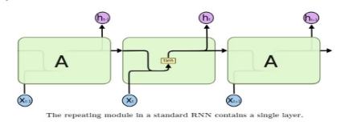Instead of having a single neural network layer, there are four, interacting in a very special way.

In the above diagram, each line carries an entire vector, from the output of one node to the inputs of others. The pink circles represent pointwise operations, like vector addition, while the yellow boxes are learned neural network layers. Lines merging denote concatenation, while a line forking denote its content being copied and the copies going to different locations. 

**Implementing LSTM**

We use keras from tensorflow. Here to implement LSTM we first import Sequential() , then import layers ; LSTM, Dense , Dropout. 

**Epochs :** 

One Epoch is when an ENTIRE dataset is passed forward and backward through the neural network only ONCE. 

we need to pass the full dataset multiple times to the same neural network. But keep in mind that we are using a limited dataset and to optimise the learning and the graph we are 

using **Gradient Descent** which is an ***iterative*** process. So, *updating the weights with single pass or one epoch is not enough.* 

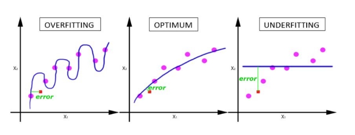One Epoch leads to underfitting. As the number of epochs increases, more number of times the weight are changed in the neural network and the curve goes 

from **underfitting** to **optimal** to **overfitting** curve. 

**XGBoost:** 

XGBoost is a decision-tree-based ensemble Machine Learning algorithm that uses a gradient boosting framework. In prediction problems involving unstructured data (images, text, etc.) artificial neural networks tend to outperform all other algorithms or frameworks. However, when it comes to small-to-medium structured/tabular data, decision tree based algorithms are considered best-in-class right now. It provides parallel tree boosting and is the leading machine learning library for regression, classification, and ranking problems.  

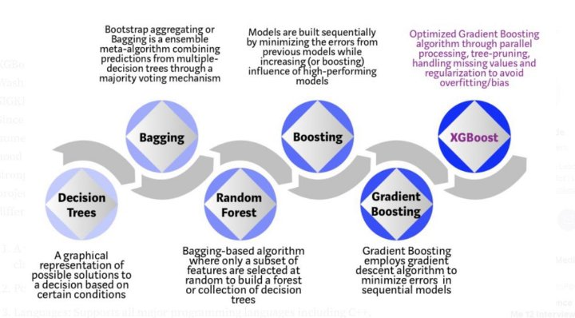

**Model Evaluating:** 

Root Mean Square Error (RMSE) is the standard deviation of the residuals (prediction errors). Residuals are a measure of how far from the regression line data points are; RMSE is a measure of how spread out these residuals are. In other words, it tells you how concentrated the data is around the line of best fit. Root mean square error is commonly used in climatology, forecasting, and regression analysis to verify experimental results. 

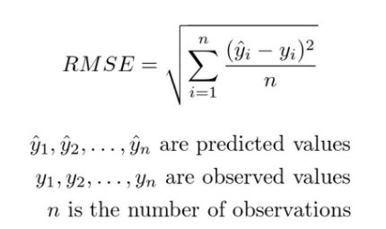

RMSE for LSTM is 1.20096 RMSE for XGBoost is 1.18939 

**Summary** 

This project has provided me with an excellent opportunity to study because it has taught me a lot about machine learning , exploratory data analysis, time series, and data preparation. Throughout the course of this project, I have encountered challenges and found a variety of solutions, which have given me new perspectives on the subjects. 

This training helped me to improve various aspects of a students and a professionals life which are:   

- Time management: how much of a wrok done everyday that counts as progress.  
- Improve Self-learning: Through practical implementation of anything, an individual can learn anything faster and more efficiently.  
- Improve my debugging skills 
- Understand a practical approach to data analysis and implementation of Neural network in a real world problem. 

My theoretical understanding of machine learning was put into practice, and I was able to apply it in the actual world. This project taught me the value of self learning, problem-solving, debugging, and identifying the best practices to increase the efficiency of model and present data in more appeasing way. Additionally, working on this project gave me invaluable experience and understanding of the industry's operations, both of which were very helpful. It, in my opinion, played a crucial role in the advancement of my profession as a data scientist . 

[Github Repository Link ](https://github.com/capital00h/tata_training_time_series)
27 
